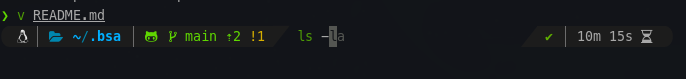
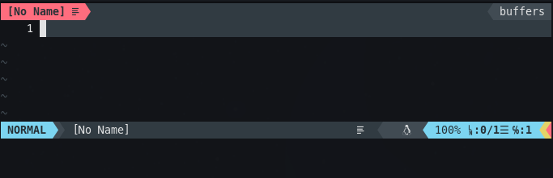

# BSA - my.dot.files

Only to prepare my environment!! :bowtie:

## Installation

Run the following code in your bash or sh termial.

```bash
sudo apt install zsh curl && sudo zsh -c "`curl -fsSL https://raw.githubusercontent.com/brunosantanaa/my-dot-files/main/install.zsh`"
```
### Update

```bash
cd ~/.bsa
git pull && ./update.zsh
```

## Environment Variables

```bash
echo "export [YOUR EXPORT]" >> ~/.localrc.zsh
```

## Content

- NeoVim
- Tmux
- Tilix
- Prezto
- PowerLevel10k
- Nodejs
- asdf
- QEMU
- Meslo Fonts
- Github cli
- Rust
- Environment Nuttx and ESP (*)
- Environment Yocto (*)

> (*) Optional installation

## Screenshots

### Terminal



### NeoVim


